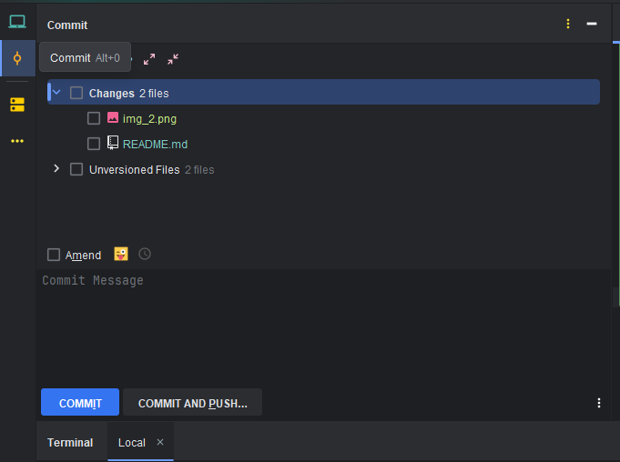

# gitmojiTest
gitmoji 도입 test repo 입니다.

## CLI TEST

```cli
(git add 생략)
git commit -m ":bento: gitmoji test"
git push origin main
```
결과


:bento: 도시락 이모지 확인 가능
---

## npm TEST

cli 명령어 (windows 기준)
```npm i -g gitmoji-cli```

```
gitmoji -c
이모지 선택(use arrow keys or tytpe to search)
commit title: {내용}
commit message: {내용}
```


결과


## IntelliJ Plugins 이용

shift 두번 탭 -> Plugins -> gitmoji 검색


설치완료 후 IDEA 재시작



IntelliJ 의 commit 탭에 생성된 아이콘 확인


commit 시 아이콘 클릭 후 이모지 선택


검색 가능


결과
